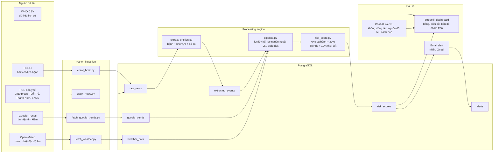

# Pipeline hệ thống theo dõi bệnh truyền nhiễm thời gian thực

## Công nghệ sử dụng


## Sơ đồ pipeline tổng thể



## Luồng xử lý chi tiết

### 1. Thu thập dữ liệu bài báo và HCDC

- `src/ingestion/crawl_hcdc.py` đọc bài từ HCDC, lấy tiêu đề, nội dung, ngày đăng và URL.
- `src/ingestion/crawl_news.py` đọc RSS và nội dung bài viết từ các nguồn báo y tế đang cấu hình.
- Dữ liệu thô được lưu vào bảng `raw_news`.
- Hệ thống không dùng Tavily/Gemini để nạp dữ liệu bài báo vào `raw_news`. AI chỉ dùng cho chat tra cứu trong dashboard.

### 2. Thu thập tín hiệu bổ trợ

- `src/ingestion/fetch_google_trends.py` lấy điểm quan tâm tìm kiếm theo bệnh và từ khóa liên quan.
- Điểm Google Trends được làm mượt bằng trung bình trượt 7 ngày trước khi lưu.
- `src/ingestion/fetch_weather.py` lấy thời tiết theo khu vực từ Open-Meteo.
- Weather risk dùng dữ liệu trễ 7-17 ngày để phản ánh độ trễ dịch tễ, đặc biệt với sốt xuất huyết.

### 3. Trích xuất thực thể bệnh

`src/processing/extract_entities.py` tách thông tin từ bài viết:

- Tên bệnh: sốt xuất huyết, tay chân miệng, cúm, sởi, thủy đậu, đau mắt đỏ, sốt rét.
- Khu vực: tỉnh/thành/quận/huyện trong `src/locations.py`.
- Số ca mắc: chỉ nhận khi câu có ngữ cảnh phù hợp.
- Loại bỏ câu có bệnh ngoài phạm vi như chlamydia, bệnh lậu, giang mai, HIV/AIDS.
- Loại bỏ ngữ cảnh nước ngoài/toàn cầu nếu không có khu vực Việt Nam cụ thể.

Kết quả được lưu vào bảng `extracted_events`.

### 4. Làm sạch số liệu trước khi tính điểm

`src/processing/pipeline.py` loại các số liệu không phù hợp cho `cases_7d`:

- Bỏ số lũy kế: `lũy kế`, `từ đầu năm`, `đến nay`, `năm 2024`, `năm 2025`, `năm 2026`.
- Bỏ số toàn quốc nếu không gắn với khu vực cụ thể.
- Bỏ ngày tương lai.
- Chỉ dùng số ca theo tuần/kỳ hiện tại để tính risk score.

Ví dụ lỗi đã xử lý:

- `Năm 2024 ghi nhận 213.443 trường hợp mắc chlamydia` là số liệu châu Âu/bệnh ngoài phạm vi, không còn được gán vào cúm tại Việt Nam.
- Các số lớn như `46.000`, `63.000`, `22.400` nếu là số lũy kế/toàn quốc sẽ không dùng làm `cases_7d`.

### 5. Tính điểm rủi ro và phân vùng ổ dịch

Công thức hiện tại:

```text
Risk score = case_signal * 70% + google_trends_signal * 20% + weather_lag_signal * 10%
```

Trong đó:

- `case_signal`: số ca theo kỳ gần nhất, chuẩn hóa theo ngưỡng từng bệnh.
- `google_trends_signal`: tín hiệu tìm kiếm đã làm mượt.
- `weather_lag_signal`: nguy cơ thời tiết, dùng mưa/độ ẩm/nhiệt độ giai đoạn 7-17 ngày trước.

Phân loại:

| Điểm | Mức |
|---:|---|
| `>= 75` | Đỏ |
| `>= 50` | Cam |
| `>= 25` | Vàng |
| `< 25` | Xanh |

Kết quả lưu vào bảng `risk_scores`.

### 6. Dashboard và cảnh báo

`dashboard/app.py` hiển thị:

- KPI tổng quan.
- Bảng rủi ro hiện tại.
- Lịch sử rủi ro từng ngày từ bảng `risk_scores`.
- Biểu đồ thay đổi số ca dùng để tính điểm theo thời gian.
- Bản đồ chấm tròn vùng dịch.
- Diễn biến ca ghi nhận từ `extracted_events`.
- Google Trends, WHO theo năm, dữ liệu thời tiết.
- Chat AI dùng logo `Lo_go/Logo_AI.png`.

Email cảnh báo:

- `src/alerting/email_alert.py` gửi mail khi có cảnh báo Đỏ.
- Có thể gửi nhiều Gmail qua `EMAIL_TO=a@gmail.com,b@gmail.com`.
- Bảng `alerts` lưu trạng thái gửi để tránh gửi trùng cùng một cảnh báo.

## Bảng dữ liệu chính

| Bảng | Vai trò |
|---|---|
| `raw_news` | Lưu bài viết/raw text từ HCDC và RSS báo y tế |
| `extracted_events` | Lưu bệnh, khu vực, số ca đã trích xuất |
| `google_trends` | Lưu tín hiệu tìm kiếm theo bệnh/từ khóa/ngày |
| `weather_data` | Lưu thời tiết theo ngày/khu vực |
| `risk_scores` | Lưu điểm rủi ro theo ngày/bệnh/khu vực |
| `alerts` | Lưu lịch sử gửi cảnh báo |

## Các bài báo và nguồn tham khảo

1. HCDC - Tình hình sốt xuất huyết, tay chân miệng tại TP.HCM tuần 10/2026:  
   https://hcdc.vn/tinh-hinh-dich-benh-sot-xuat-huyet-tay-chan-mieng-tren-dia-ban-tp-ho-chi-minh-tinh-den-tuan-102026-y3YJ09.html

2. Tuổi Trẻ - bài đang được hệ thống trích xuất số liệu `414` ca sốt xuất huyết và `1.063` ca tay chân miệng:  
   https://tuoitre.vn/tin-tuc-sang-22-5-lai-suat-qua-dem-xuong-con-6-nam-20260521073005825.htm

3. Sức khỏe Đời sống - TP.HCM đẩy mạnh kiểm soát và điều trị bệnh tay chân miệng:  
   https://giadinh.suckhoedoisong.vn/tphcm-day-manh-kiem-soat-va-dieu-tri-benh-tay-chan-mieng-172260329152144298.htm

4. Sức khỏe Đời sống - Viện Pasteur TP.HCM giám sát phòng chống tay chân miệng và sốt xuất huyết tại Tây Ninh:  
   https://suckhoedoisong.vn/vien-pasteur-tphcm-giam-sat-phong-chong-tay-chan-mieng-va-sot-xuat-huyet-tai-tay-ninh-169260416202918781.htm

5. Sức khỏe Đời sống - Gia tăng ca tay chân miệng và sốt xuất huyết, người dân cần nâng cao ý thức phòng bệnh:  
   https://suckhoedoisong.vn/gia-tang-ca-mac-tay-chan-mieng-va-sot-xuat-huyet-nguoi-dan-can-nang-cao-y-thuc-phong-benh-169260414061934109.htm

6. HCDC - Trang chủ nguồn tin dịch bệnh TP.HCM:  
   https://hcdc.vn/

